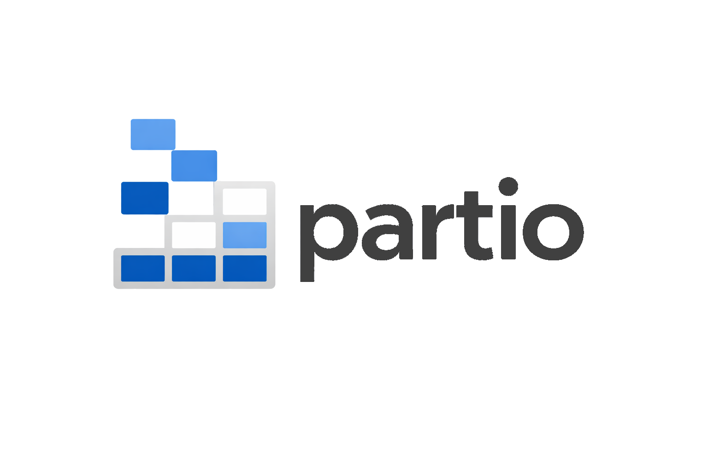
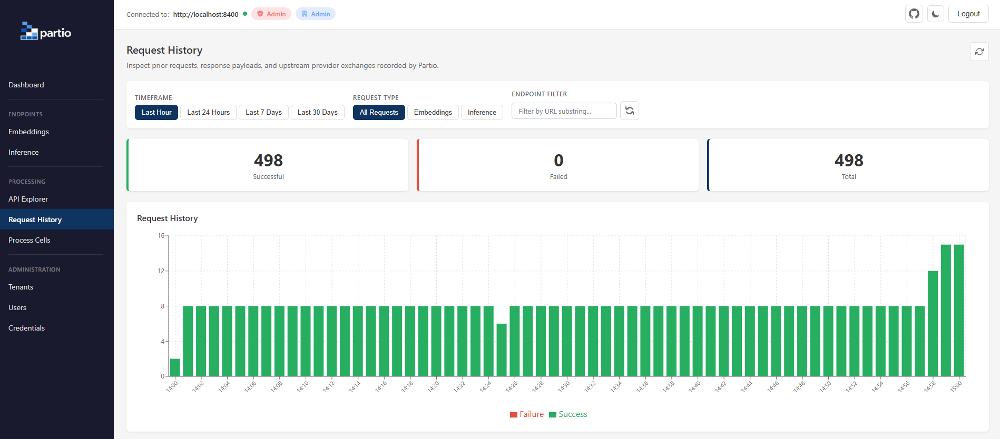
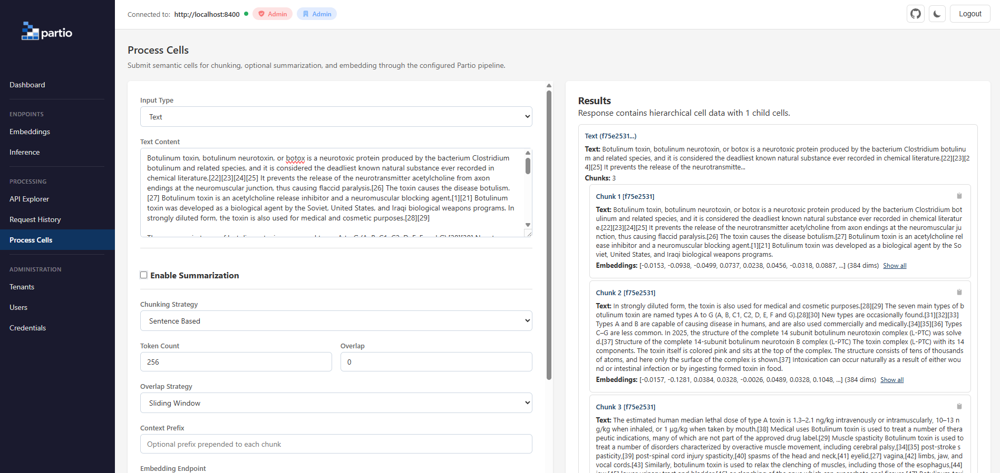
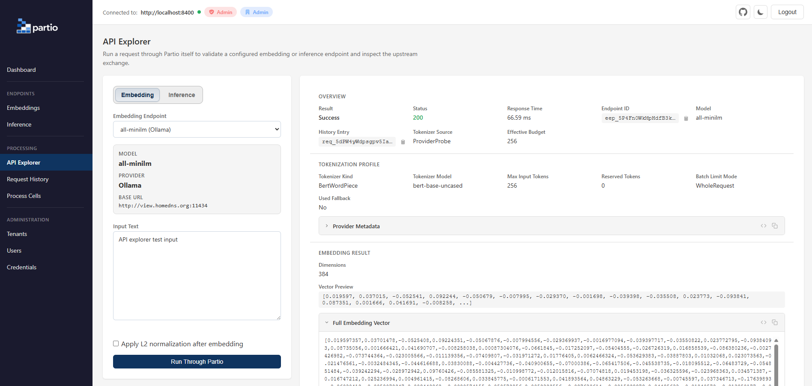
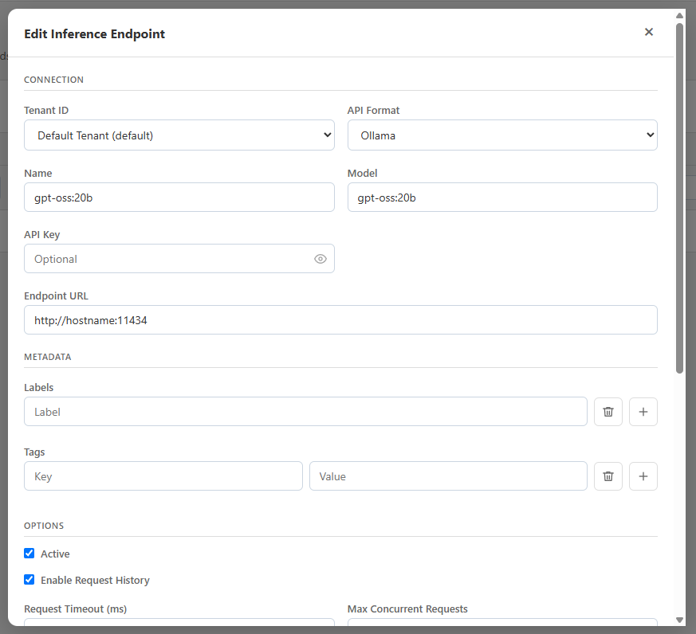

<p align="center">
  
</p>

<p align="center">
  
  
  
  
  
  
</p>

---

> ### ⚠️ v0.4.0 — Alpha
>
> Partio is **alpha software**. It works, it's tested, and it's useful today — but APIs, models, configuration keys, and response shapes are **subject to change** while we iterate toward a stable surface.
>
> Versioning during alpha is **not** semantic. Treat every `0.x` bump as potentially breaking, pin to a specific Docker image tag, and read [CHANGELOG.md](CHANGELOG.md) before upgrading. We will **switch to [semver](https://semver.org/) at v1.0.0**, at which point the API contract becomes stable and breaking changes will only land on major versions.
>
> If you're building on Partio now: great — please [file issues](https://github.com/jchristn/partio/issues) and tell us what hurts. That feedback is what gets us to 1.0.

---

## What It Is

Partio is a **multi-tenant, RESTful chunking and embedding platform** for AI and RAG pipelines. You send it structured content — a *semantic cell* — along with a chunking and embedding policy, and it returns text chunks with computed embedding vectors, ready to write to your vector store.

Instead of scattering tokenizer logic, chunk-sizing heuristics, provider SDKs, and retry code across every service that touches embeddings, you define **endpoints** (provider + model + tokenization policy) once and call them the same way across tenants and applications. Partio owns the messy parts — token budgeting, provider quirks, health checks, batching — so your application code stays about your product.

It ships as a server, a React admin dashboard, three SDKs (C#, Python, JavaScript), and Docker images.

## Screenshots

**Request History** — every request through Partio is recorded, including the upstream provider exchange, with success/failure rollups and a live timeline.

<p align="center"></p>

**Process Cells** — an interactive playground for submitting semantic cells, picking a chunking strategy, optionally summarizing, and inspecting the returned chunks and their embedding vectors.

<p align="center"></p>

**API Explorer** — exercise a single embedding or inference endpoint *through Partio's own path* and inspect the resolved tokenization profile, effective token budget, timing, and raw upstream call.

<p align="center"></p>

**Endpoint management** — configure embedding and inference endpoints per tenant, with provider format, model, labels/tags, timeouts, and concurrency limits.

<p align="center"></p>

## What It Does

- **Chunks** structured content using type-aware strategies (token, sentence, paragraph, regex, list, and table strategies), sizing every chunk to the target embedding model's real token budget.
- **Embeds** chunks (or arbitrary strings) through pluggable providers: Ollama, OpenAI, Gemini, and OpenAI-compatible backends like vLLM.
- **Summarizes** cells with an LLM before chunking and embedding, when you want denser or condensed representations.
- **Exposes each stage independently** — `/v1.0/chunk`, `/v1.0/embed`, and `/v1.0/summarize` — so you can run and time chunking, embedding, and summarization on their own, or combine them in one call with `/v1.0/process`.
- **Isolates tenants** — tenants, users, credentials, and endpoints are fully partitioned behind scoped bearer tokens.
- **Records everything** — full request history with upstream call capture, headers, bodies, timing, and status, with configurable retention.
- **Monitors endpoints** — background health checks gate traffic away from unhealthy providers automatically.

## Who It's For

- **AI / ML engineers** building RAG pipelines who want a dedicated chunking-and-embedding service that decouples document processing from the rest of the stack.
- **Platform engineers** who need multi-tenant isolation, audit logging, and database portability for embedding workloads.
- **DevOps teams** centralizing and scaling embedding generation behind one API, across multiple models and providers.
- **Developers** prototyping semantic search, knowledge bases, or AI features who want to skip wiring up chunking and embedding by hand.

## Use Cases and Benefits

| You're building… | Partio gives you… |
|---|---|
| A RAG ingestion pipeline | Type-aware chunking + embeddings from one endpoint, deterministic chunk output, and traceable labels/tags from input to every chunk. |
| A multi-tenant SaaS with per-customer embeddings | Row-level tenant isolation, scoped credentials, and per-tenant endpoint configuration. |
| A model/provider migration | A config-only switch between Ollama, OpenAI, Gemini, and vLLM — no application code changes. |
| An embedding gateway for many apps | One API, policy-managed endpoints, health gating, timeouts, and concurrency caps enforced centrally. |
| Anything you have to debug | Full request history + an API Explorer that shows the exact upstream exchange, tokenizer source, and effective budget. |

**Why not roll your own?** The hard parts of embedding infrastructure aren't the happy path — they're correct token budgeting across tokenizers, provider-specific batching and warm-up, health gating, and traceability. Partio centralizes those so you don't reimplement them per service.

## How It Works

```
                                                  ┌─────────────────────┐
  Semantic Cell  ─────►  Partio  ──►  Chunk  ──►  Embedding endpoint    │
  (Text/List/Table/…)      │           engine     (Ollama/OpenAI/…)     │
  + chunking policy        │             │        └──────────┬──────────┘
  + embedding endpoint     │             │                   │
                           │        ┌────▼────┐         embeddings
                           │        │ resolve │              │
                           │        │  token  │◄─────────────┘
                           │        │ budget  │
                           │        └─────────┘
                           ▼
                  Chunks + embeddings  (labels/tags echoed through)
```

1. You submit a **semantic cell** (typed content) plus a `ChunkingConfiguration` and an `EmbeddingConfiguration` naming a configured endpoint.
2. Partio resolves the **tokenization profile** for that endpoint (see below) and computes the effective token budget.
3. The **chunking engine** splits the content with the chosen strategy, descending within the strategy so no emitted chunk exceeds the budget *before* any upstream call is made.
4. Chunks are **embedded** through the endpoint's provider, with batching, timeout caps, and concurrency limits applied.
5. Partio returns chunks with embeddings, echoing your **labels and tags** onto each chunk for downstream traceability, and records the full exchange in request history.

### Tokenization resolution

Partio resolves the tokenization profile used for chunk sizing, chunk slicing, and embedding batching in this order:

1. Endpoint-level `Tokenization` override
2. Live provider probe plus a short-lived in-memory cache
3. Provider default registry
4. Server-wide `TokenizationDefaults.GlobalFallback`

`FixedTokenCount` means a requested budget **in the active embedding endpoint's token space**, not a hardcoded `cl100k_base` approximation. Semantic strategies also descend within the strategy flow when one sentence, paragraph, list item, or table unit is too large, so emitted chunks are already in-budget before Partio calls the upstream embedding endpoint.

For diagnostics, embedding responses expose these headers when applicable:

- `X-Partio-Tokenizer-Kind`
- `X-Partio-Tokenizer-Model`
- `X-Partio-Tokenizer-Source`
- `X-Partio-Effective-Input-Budget`

## How to Get Started

Partio is distributed as **Docker images**, and the fastest path is Docker Compose — it brings up the server, the dashboard, and a local Ollama instance wired together for you.

### Docker Compose (recommended)

```bash
git clone https://github.com/jchristn/partio.git
cd partio/docker
docker compose up -d
```

Pull the default embedding model into the bundled Ollama:

```bash
# Bash / macOS / Linux
curl http://localhost:11434/api/pull -d '{"name": "nomic-embed-text"}'

# Windows Terminal (cmd)
curl http://localhost:11434/api/pull -d "{\"name\": \"nomic-embed-text\"}"
```

| Component | URL | Docker Image |
|-----------|-----|--------------|
| Server | http://localhost:8400 | `jchristn77/partio-server` |
| Dashboard | http://localhost:8401 | `jchristn77/partio-dashboard` |
| Ollama | (internal via shared network) | `ollama/ollama` |

The Ollama container shares the server's network namespace, so the default `localhost:11434` endpoint works without any configuration changes. Models persist in a Docker volume across restarts.

### Docker (server only)

If you already run Ollama (or another provider) yourself:

```bash
docker run -d -p 8400:8400 jchristn77/partio-server
```

> Inside the container, `localhost` is **not** your host machine. Point endpoints at `host.docker.internal` or the container network address of your provider.

Both images are multi-architecture (`linux/amd64` and `linux/arm64`).

### First-run defaults

On first startup, Partio writes a `partio.json` settings file and seeds the database:

> [!CAUTION]
> **Local development only.** Change all default credentials before any production or shared deployment.
>
> | Resource | ID | Details |
> |----------|----|---------|
> | Tenant | `default` | Default Tenant |
> | User | `default` | admin@partio / password (admin) |
> | Credential | `default` | Bearer token `default` |
> | Admin API Key | &mdash; | `partioadmin` |

### First request

```bash
curl -X POST http://localhost:8400/v1.0/process \
  -H "Authorization: Bearer partioadmin" \
  -H "Content-Type: application/json" \
  -d '{
    "Type": "Text",
    "Text": "Partio centralizes your chunking and embedding workflow. It accepts semantic cells and returns chunks with embeddings.",
    "ChunkingConfiguration": { "Strategy": "SentenceBased" },
    "EmbeddingConfiguration": { "EmbeddingEndpointId": "eep_YOUR_ENDPOINT_ID" }
  }'
```

```json
{
  "Text": "Partio centralizes your chunking and embedding workflow. It accepts semantic cells and returns chunks with embeddings.",
  "Chunks": [
    {
      "Text": "Partio centralizes your chunking and embedding workflow.",
      "Labels": [],
      "Tags": {},
      "Embeddings": [0.0123, -0.0456, 0.0789, "... (768 floats for nomic-embed-text)"]
    },
    {
      "Text": "It accepts semantic cells and returns chunks with embeddings.",
      "Labels": [],
      "Tags": {},
      "Embeddings": [0.0321, -0.0654, 0.0987, "... (768 floats for nomic-embed-text)"]
    }
  ]
}
```

## Features

- **Standalone chunk, embed, and summarize endpoints** (`POST /v1.0/chunk`, `/v1.0/embed`, `/v1.0/summarize`) so each stage can be run and timed independently, in addition to the combined `/v1.0/process`. Chunking uses a built-in tokenizer and needs no embedding endpoint.
- **Multiple chunking strategies** — fixed token count, sentence, paragraph, regex, whole list, list entry, and several table strategies — with configurable overlap via sliding window.
- **Endpoint-aware token budgeting** with model-native token counting, endpoint overrides, provider probing where available, provider defaults, and a required global fallback profile.
- **Pluggable provider support** for Ollama, OpenAI, Gemini, and OpenAI-compatible backends such as vLLM, selectable per endpoint.
- **Multi-tenant architecture** with tenant, user, credential, and endpoint isolation.
- **Four database backends** out of the box: SQLite (default, zero config), PostgreSQL, MySQL, and SQL Server.
- **Request history and audit logging** with automatic cleanup, filesystem body persistence, configurable retention, and upstream embedding call capture (request/response headers, bodies, timing, and status for each provider call).
- **Bearer token authentication** with global admin API keys and tenant-scoped credentials.
- **Endpoint health checks** with configurable background monitoring, threshold-based state transitions, and automatic request gating (unhealthy endpoints return `502`).
- **Endpoint metadata** — `Labels` and string key/value `Tags` on embedding and inference endpoints for operator-owned grouping and routing context.
- **Model loading and warming** for configured endpoints, with native Ollama preload and warm-request semantics for OpenAI, Gemini, and vLLM.
- **Per-endpoint provider timeout caps** with a default 60-second ceiling, configurable in the API and dashboard and enforced independently from health checks.
- **Batch processing** for submitting multiple semantic cells in a single request.
- **Optional LLM summarization** before chunking and embedding, supporting top-down and bottom-up strategies.
- **Completion (inference) endpoint management** for configuring LLM endpoints (Ollama, OpenAI, Gemini, vLLM) with health checks.
- **API Explorer** in the dashboard for exercising a specific embedding or inference endpoint through the Partio backend path and inspecting upstream call details.
- **PolyPrompt-backed provider runtime** centralizing provider-specific embeddings and inference wiring in a dedicated library.
- **Admin dashboard** (React/Vite) for managing tenants, users, credentials, endpoints, and viewing request history.
- **SDKs** for C#, Python, and JavaScript.
- **Docker images** with multi-architecture support (amd64/arm64).
- **Pagination and filtering** with cursor-based continuation tokens, sorting, and label/tag/name/active filters on all list endpoints.

## Architecture and Components

```
Partio.Core          - Models, settings, database, chunking engine, embedding clients
Partio.Server        - REST API server, authentication, request history
dashboard/           - React/Vite admin dashboard
sdk/csharp/          - C# SDK and test harness
sdk/python/          - Python SDK and test harness
sdk/js/              - JavaScript SDK and test harness
docker/              - Docker Compose setup and default configuration
```

- **Partio.Core** holds the domain models, the chunking engine, the tokenization-resolution logic, the provider embedding/inference clients (via PolyPrompt), and the database abstraction that lets you swap SQLite/PostgreSQL/MySQL/SQL Server with a config change.
- **Partio.Server** is the stateless REST layer: authentication, routing, request history capture, health monitoring, and endpoint management. Run multiple instances behind a load balancer against one database for horizontal scale.
- **dashboard/** is the React/Vite admin UI shown in the screenshots above.
- **sdk/** contains the C#, Python, and JavaScript clients plus their test harnesses.

### What is a semantic cell?

A **semantic cell** is a *typed unit of content* from a parsed document. Rather than sending raw text, you send structured content that Partio can chunk intelligently based on its type:

```json
{
  "Type": "Text | List | Table | Code | Image | Hyperlink | Meta | Binary",
  "Text": "string (for Text, Code, Hyperlink, Meta, Image, Binary)",
  "OrderedList": ["item 1", "item 2"],
  "UnorderedList": ["item a", "item b"],
  "Table": [["id", "name"], ["1", "Alice"], ["2", "Bob"]],
  "Labels": ["source:readme", "section:intro"],
  "Tags": { "page": "3", "heading": "Introduction" }
}
```

The `Type` determines which chunking strategies are valid. `Labels` (a flat list) and `Tags` (string key/value pairs) are metadata *you* attach; Partio never interprets them, it just carries them through so you can trace every chunk back to its source.

### What is a chunk?

A **chunk** is the *output unit* Partio produces: a slice of the cell's content, sized to fit the resolved embedding endpoint's token budget, paired with its computed embedding vector and the labels/tags inherited from the source cell.

```json
{
  "Text": "Partio centralizes your chunking and embedding workflow.",
  "Labels": ["source:readme", "section:intro"],
  "Tags": { "page": "3", "heading": "Introduction" },
  "Embeddings": [0.0123, -0.0456, 0.0789, "..."]
}
```

Chunk *text* is deterministic for a given input, strategy, and configuration. The *embedding* depends on the upstream model and provider. Because labels and tags flow from cell → chunk, you get end-to-end traceability from the document you ingested to the vectors you store.

## API Overview

All endpoints use JSON and require an `Authorization: Bearer {token}` header unless otherwise noted. See [REST_API.md](REST_API.md) for the full reference; a [Postman collection](Partio.postman_collection.json) is also included.

### Health and identity

| Method | Route | Auth | Description |
|--------|-------|------|-------------|
| `HEAD` | `/` | No | Health check |
| `GET` | `/` | No | Health status |
| `GET` | `/v1.0/health` | No | Health (JSON) |
| `GET` | `/v1.0/whoami` | Yes | Caller identity |

### Processing

| Method | Route | Description |
|--------|-------|-------------|
| `POST` | `/v1.0/process` | Chunk + (optionally summarize) + embed a single semantic cell |
| `POST` | `/v1.0/process/batch` | Process multiple semantic cells |
| `POST` | `/v1.0/chunk` | Chunk a cell into text chunks **without** embedding (uses the built-in tokenizer; no endpoint required) |
| `POST` | `/v1.0/embed` | Embed one or more strings (batch) through an embedding endpoint, **without** chunking |
| `POST` | `/v1.0/summarize` | Summarize text through a completion endpoint, **without** chunking or embedding |

### Explorer

| Method | Route | Description |
|--------|-------|-------------|
| `POST` | `/v1.0/explorer/embedding` | Exercise one embedding endpoint through Partio and inspect upstream call details |
| `POST` | `/v1.0/explorer/completion` | Exercise one inference endpoint through Partio and inspect upstream call details |

### Model loading

| Method | Route | Description |
|--------|-------|-------------|
| `POST` | `/v1.0/endpoints/embedding/{id}/load` | Load or warm one embedding endpoint model |
| `POST` | `/v1.0/endpoints/completion/{id}/load` | Load or warm one inference endpoint model |

Ollama endpoints can return `Loaded` because Partio uses Ollama's native keep-alive preload path. OpenAI, Gemini, and vLLM endpoints return `Warmed` when their minimal provider request succeeds; vLLM must already be serving the configured model.

### Endpoint health

| Method | Route | Auth | Description |
|--------|-------|------|-------------|
| `GET` | `/v1.0/endpoints/embedding/{id}/health` | Yes | Health status for one endpoint |
| `GET` | `/v1.0/endpoints/embedding/health` | Yes | Health status for all endpoints |

### Administration (CRUD + enumerate)

Each admin resource supports `PUT` (create), `GET` (read), `PUT /{id}` (update), `DELETE /{id}`, `HEAD /{id}` (exists), and `POST /enumerate` (list).

| Resource | Route Prefix | ID Prefix |
|----------|-------------|-----------|
| Tenants | `/v1.0/tenants` | `ten_` |
| Users | `/v1.0/users` | `usr_` |
| Credentials | `/v1.0/credentials` | `cred_` |
| Endpoints | `/v1.0/endpoints/embedding` | `eep_` |
| Completion Endpoints | `/v1.0/endpoints/completion` | `cep_` |
| Request History | `/v1.0/requests` | `req_` |

### Example: batch processing

```bash
curl -X POST http://localhost:8400/v1.0/process/batch \
  -H "Authorization: Bearer partioadmin" \
  -H "Content-Type: application/json" \
  -d '[
    { "Type": "Text", "Text": "First document to embed." },
    { "Type": "Text", "Text": "Second document to embed." }
  ]'
```

## Chunking Strategies

| Strategy | Description |
|----------|-------------|
| `FixedTokenCount` | Split content into chunks of a fixed token count in the active embedding endpoint's token space. Configurable overlap via `OverlapCount` or `OverlapPercentage`. |
| `SentenceBased` | Split at sentence boundaries. |
| `ParagraphBased` | Split at paragraph boundaries. |
| `WholeList` | Treat an entire list as a single chunk. |
| `ListEntry` | Each list entry becomes its own chunk. |
| `Row` | Each table data row as space-separated values (no headers). |
| `RowWithHeaders` | Each table data row as a markdown table with headers prepended. |
| `RowGroupWithHeaders` | Groups of N table rows with headers (configurable via `RowGroupSize`, default 5). |
| `KeyValuePairs` | Each table row as key-value pairs (e.g. `"id: 1, firstname: george, lastname: bush"`). |
| `WholeTable` | Entire table as a single markdown table chunk. |
| `RegexBased` | Split at boundaries defined by a user-supplied regular expression (`RegexPattern`). Works with any content type. |

Supported content types: Text, Code, Hyperlink, Meta, Lists (ordered/unordered), Tables, Binary, and Image.

### Strategy compatibility

Not all strategies work with all content types. The generic strategies (`FixedTokenCount`, `SentenceBased`, `ParagraphBased`, `RegexBased`) work with any type. List strategies (`WholeList`, `ListEntry`) only work with `List`. Table strategies (`Row`, `RowWithHeaders`, `RowGroupWithHeaders`, `KeyValuePairs`, `WholeTable`) only work with `Table`. The API returns `400 Bad Request` if an incompatible strategy is used.

| Strategy | Text | Code | Hyperlink | Meta | List | Table | Binary | Image | Unknown |
|---|---|---|---|---|---|---|---|---|---|
| FixedTokenCount | Y | Y | Y | Y | Y | Y | Y | Y | Y |
| SentenceBased | Y | Y | Y | Y | Y | Y | Y | Y | Y |
| ParagraphBased | Y | Y | Y | Y | Y | Y | Y | Y | Y |
| RegexBased | Y | Y | Y | Y | Y | Y | Y | Y | Y |
| WholeList | | | | | Y | | | | |
| ListEntry | | | | | Y | | | | |
| Row | | | | | | Y | | | |
| RowWithHeaders | | | | | | Y | | | |
| RowGroupWithHeaders | | | | | | Y | | | |
| KeyValuePairs | | | | | | Y | | | |
| WholeTable | | | | | | Y | | | |

## Configuration File Reference

Partio is configured via `partio.json`, created automatically on first run.

```json
{
  "Rest": {
    "Hostname": "0.0.0.0",
    "Port": 8400,
    "Ssl": false
  },
  "Database": {
    "Type": "Sqlite",
    "Filename": "./partio.db"
  },
  "Logging": {
    "ConsoleLogging": true,
    "FileLogging": true,
    "LogDirectory": "./logs/",
    "LogFilename": "partio.log",
    "MinimumSeverity": 0
  },
  "RequestHistory": {
    "Enabled": true,
    "Directory": "./request-history/",
    "RetentionDays": 7,
    "CleanupIntervalMinutes": 60
  },
  "TokenizationDefaults": {
    "GlobalFallback": {
      "TokenizerKind": "Cl100kBase",
      "TokenizerModel": "cl100k_base",
      "MaxInputTokens": 8192,
      "ReservedInputTokens": 0,
      "BatchLimitMode": "PerInput",
      "AutoDetect": true
    },
    "OpenAI": {
      "TokenizerKind": "Cl100kBase",
      "TokenizerModel": "cl100k_base",
      "MaxInputTokens": 8192,
      "ReservedInputTokens": 0,
      "BatchLimitMode": "PerInput",
      "AutoDetect": true
    },
    "vLLM": {
      "TokenizerKind": "Cl100kBase",
      "TokenizerModel": "cl100k_base",
      "MaxInputTokens": 8192,
      "ReservedInputTokens": 0,
      "BatchLimitMode": "PerInput",
      "AutoDetect": true
    },
    "Gemini": {
      "TokenizerKind": "Cl100kBase",
      "TokenizerModel": "cl100k_base",
      "MaxInputTokens": 2048,
      "ReservedInputTokens": 0,
      "BatchLimitMode": "PerInput",
      "AutoDetect": true
    },
    "Ollama": null,
    "CapabilityCacheTtlSeconds": 300
  },
  "AdminApiKeys": ["partioadmin"],
  "DefaultEmbeddingEndpoints": [
    {
      "Model": "nomic-embed-text",
      "Endpoint": "http://localhost:11434",
      "ApiFormat": "Ollama",
      "MaximumTimeoutMs": 60000,
      "MaxConcurrentRequests": 2,
      "Labels": ["default", "embedding"],
      "Tags": { "provider": "ollama" }
    }
  ],
  "DefaultInferenceEndpoints": [
    {
      "Model": "gemma3:4b",
      "Endpoint": "http://localhost:11434",
      "ApiFormat": "Ollama",
      "MaximumTimeoutMs": 60000,
      "MaxConcurrentRequests": 2,
      "Labels": ["default", "inference"],
      "Tags": { "provider": "ollama" }
    }
  ]
}
```

Embedding endpoints also accept an optional `Tokenization` object with `TokenizerKind`, `TokenizerModel`, `MaxInputTokens`, `ReservedInputTokens`, `BatchLimitMode`, and `AutoDetect` fields. Both embedding and inference endpoint definitions accept `Labels` and string key/value `Tags`, plus `MaximumTimeoutMs` (milliseconds, clamped server-side to a positive non-zero integer) and `MaxConcurrentRequests` (clamped to `>= 1`, default `2`).

### Database options

| Type | Config Value | Notes |
|------|-------------|-------|
| SQLite | `Sqlite` | Default. Zero configuration, file-based. |
| PostgreSQL | `Postgresql` | Set `Hostname`, `Port`, `DatabaseName`, `Username`, `Password`. |
| MySQL | `Mysql` | Set `Hostname`, `Port`, `DatabaseName`, `Username`, `Password`. |
| SQL Server | `SqlServer` | Set `Hostname`, `Port`, `DatabaseName`, `Username`, `Password`. |

### Debug logging

Set the following in `partio.json` and restart the server. Logs are written to `./logs/` by default.

```json
{
  "Logging": { "MinimumSeverity": 0 },
  "Debug": {
    "Authentication": true,
    "Exceptions": true,
    "Requests": true,
    "DatabaseQueries": true
  }
}
```

## SDK Reference

Partio ships first-party SDKs for C#, Python, and JavaScript. Each wraps the full API surface — processing, the standalone chunk/embed/summarize routes, endpoint CRUD (including `Tokenization`, `MaximumTimeoutMs`, and `MaxConcurrentRequests`), the explorer, and health.

### C#

```csharp
using Partio.Sdk;
using Partio.Sdk.Models;

using PartioClient client = new PartioClient("http://localhost:8400", "partioadmin");

SemanticCellResponse? response = await client.ProcessAsync(new SemanticCellRequest
{
    Type = "Text",
    Text = "Hello world",
    EmbeddingConfiguration = new EmbeddingConfiguration { EmbeddingEndpointId = "eep_YOUR_ENDPOINT_ID" }
});

EndpointExplorerCompletionResponse? explorer = await client.ExploreCompletionEndpointAsync(new EndpointExplorerCompletionRequest
{
    EndpointId = "cep_YOUR_ENDPOINT_ID",
    Prompt = "Explain what Partio does in one short paragraph.",
    TimeoutMs = 60000
});
```

Explorer responses include `TokenizationProfile`. When a process route times out upstream, the SDK throws `PartioException` with HTTP status `504`; when an endpoint is already at its concurrency ceiling, Partio returns HTTP `429`.

### Python

```python
from partio_sdk import PartioClient

with PartioClient("http://localhost:8400", "partioadmin") as client:
    endpoint = client.create_endpoint({
        "TenantId": "default",
        "Name": "Pinned MiniLM",
        "Model": "all-minilm",
        "Endpoint": "http://localhost:11434",
        "ApiFormat": "Ollama",
        "MaximumTimeoutMs": 60000,
        "MaxConcurrentRequests": 2,
        "Tokenization": {
            "TokenizerKind": "BertWordPiece",
            "TokenizerModel": "bert-base-uncased",
            "MaxInputTokens": 512,
            "ReservedInputTokens": 0,
            "BatchLimitMode": "PerInput",
            "AutoDetect": True
        }
    })

    result = client.process({
        "Type": "Text",
        "Text": "Hello world",
        "ChunkingConfiguration": {"Strategy": "FixedTokenCount", "FixedTokenCount": 256},
        "EmbeddingConfiguration": {"EmbeddingEndpointId": "eep_YOUR_ENDPOINT_ID"}
    })
    explorer = client.explore_completion_endpoint({
        "EndpointId": "cep_YOUR_ENDPOINT_ID",
        "Prompt": "Explain what Partio does in one short paragraph.",
        "TimeoutMs": 60000
    })
```

Timeout failures from process routes raise `PartioError`/`PartioException` with status code `504`. Explorer responses stay `200 OK` and report the upstream timeout through the payload `StatusCode`.

### JavaScript

```javascript
import { PartioClient } from './partio-sdk.js';

const client = new PartioClient('http://localhost:8400', 'partioadmin');

const endpoint = await client.createEndpoint({
  TenantId: 'default',
  Name: 'Pinned MiniLM',
  Model: 'all-minilm',
  Endpoint: 'http://localhost:11434',
  ApiFormat: 'Ollama',
  MaximumTimeoutMs: 60000,
  MaxConcurrentRequests: 2,
  Tokenization: {
    TokenizerKind: 'BertWordPiece',
    TokenizerModel: 'bert-base-uncased',
    MaxInputTokens: 512,
    ReservedInputTokens: 0,
    BatchLimitMode: 'PerInput',
    AutoDetect: true
  }
});

const result = await client.process({
  Type: 'Text',
  Text: 'Hello world',
  ChunkingConfiguration: { Strategy: 'FixedTokenCount', FixedTokenCount: 256 },
  EmbeddingConfiguration: { EmbeddingEndpointId: 'eep_YOUR_ENDPOINT_ID' }
});

const explorer = await client.exploreCompletionEndpoint({
  EndpointId: 'cep_YOUR_ENDPOINT_ID',
  Prompt: 'Explain what Partio does in one short paragraph.',
  TimeoutMs: 60000
});
```

## Contributing: Issues, Enhancements, and PRs

Partio is alpha and moving fast — feedback and contributions are welcome.

### File a bug

[Open an issue](https://github.com/jchristn/partio/issues) and include:

1. The Partio version (`v0.4.0`, or the Docker image tag)
2. Steps to reproduce
3. The request/response (redact any credentials)
4. Relevant log output from `./logs/`

### Request an enhancement

[Open an issue](https://github.com/jchristn/partio/issues) labeled as a feature request, or [start a discussion](https://github.com/jchristn/partio/discussions) if you want to talk through an idea before it's fully formed. Describe the use case and the outcome you want, not just the mechanism — it helps us find the right shape while the API is still malleable.

### Submit a pull request

1. Fork the repo and create a branch off `main`.
2. Make your change. Keep the diff focused and match the surrounding code style.
3. Add or update tests. The .NET runners are self-contained — `dotnet test src/Partio.sln` spins up an isolated server and an Ollama-compatible stub, so no local deployment is required.
4. Note any user-facing change in [CHANGELOG.md](CHANGELOG.md).
5. Open the PR against `main` with a clear description of what and why. Link the issue it addresses.

Because we're pre-1.0, breaking changes are on the table — but call them out explicitly in the PR so we can sequence them and document the migration.

## License

[MIT](LICENSE.md) &copy; 2026 Joel Christner
